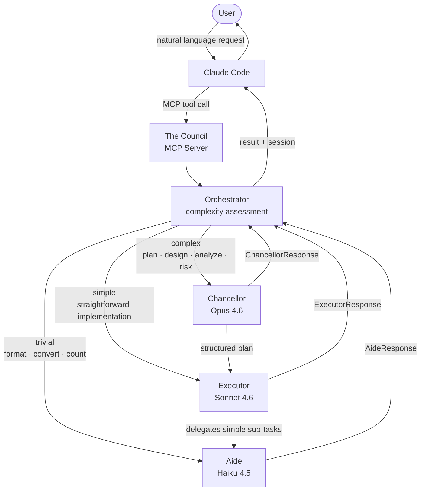
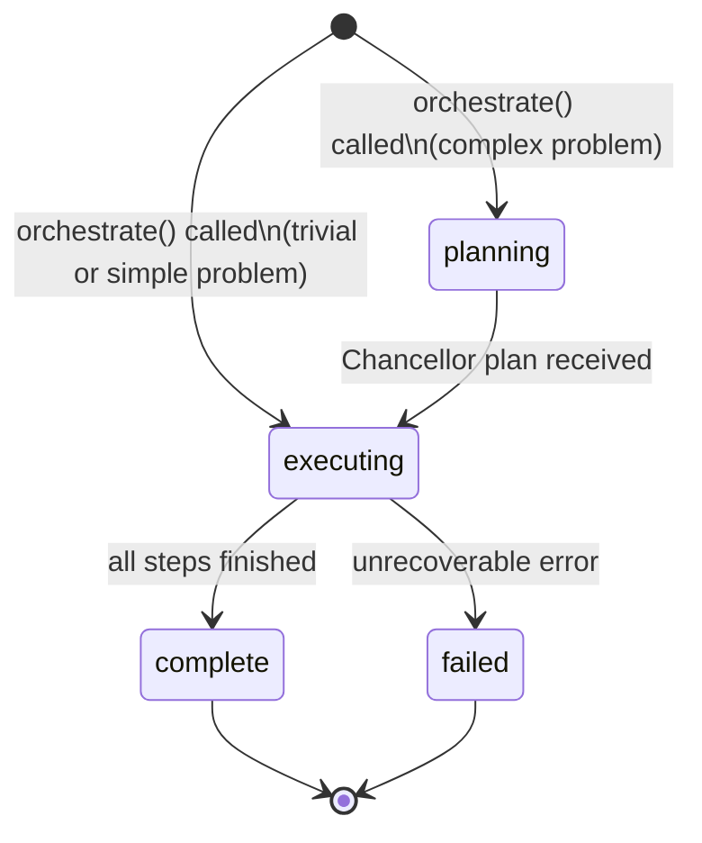

# The Council

[](https://www.npmjs.com/package/@iamvirul/the-council)
[](https://github.com/iamvirul/the-council/actions/workflows/ci.yml)
[](https://opensource.org/licenses/MIT)

> A three-tier AI agent orchestration system that runs inside Claude Code — no API key, no extra setup.

The Council is a TypeScript [Model Context Protocol (MCP)](https://modelcontextprotocol.io) server that exposes a hierarchy of three specialised Claude agents — **Chancellor**, **Executor**, and **Aide** — accessible directly inside Claude Code. When you hand it a problem, The Council automatically assesses complexity and routes it to the right agent tier: a trivial formatting task goes straight to the fast, cost-efficient Aide; a medium implementation task goes to the Executor; a complex architectural problem first passes through the Chancellor for strategic planning before the Executor drives implementation step-by-step, delegating sub-tasks down to the Aide. All agents run as sub-agents of your existing Claude Code session — no separate Anthropic API key is needed.

---

## How It Works



**Complexity routing** is deterministic — no extra LLM call:

| Signal | Complexity | Agents invoked |
|---|---|---|
| Word count > 60, or keywords: `plan`, `design`, `architect`, `strategy`, `analyze`, `assess`, `risk` | Complex | Chancellor → Executor → Aide (as needed) |
| Word count 15–60, no strong signal | Simple | Executor → Aide (as needed) |
| Word count < 15, keywords: `format`, `convert`, `transform`, `clean`, `list`, `count` | Trivial | Aide only |

---

## Agent Roles

| Agent | Model | Role | Tools available | Max turns |
|---|---|---|---|---|
| **Chancellor** | `claude-opus-4-6` | Strategic architect: deep problem analysis, step-by-step planning, risk assessment, delegation strategy | None (pure reasoning) | 3 |
| **Executor** | `claude-sonnet-4-6` | Tactical implementer: executes each plan step, produces code/designs/solutions, delegates simple sub-tasks to the Aide | `Read`, `Write`, `Edit`, `Bash`, `Glob`, `Grep` | 10 |
| **Aide** | `claude-haiku-4-5` | Support specialist: formatting, data transformation, text processing, simple utilities | None (pure reasoning) | 3 |

---

## Orchestration Flow


---

## MCP Tools Reference

| Tool | Description | Key inputs |
|---|---|---|
| `orchestrate` | Route a problem through The Council. Complexity is assessed automatically; the correct agent tier is invoked. | `problem` (string, max 10 000 chars) |
| `consult_chancellor` | Invoke the Chancellor directly for deep strategic analysis. Returns a structured plan with steps, risks, assumptions, and success metrics. | `problem`, `context?` |
| `execute_with_executor` | Invoke the Executor directly for implementation. The Executor has access to file and shell tools. | `task`, `plan_context?`, `session_id?` |
| `delegate_to_aide` | Invoke the Aide directly for simple, well-defined tasks: formatting, transformation, utilities. | `task` (max 2 000 chars), `task_id?`, `context?`, `session_id?` |
| `get_council_state` | Retrieve the full state of a session by ID, or list all active sessions with summary info. | `session_id?` |

---

## Installation & Setup

**Requirements:** Node.js 22+

### Option A — npx (no install required)

```bash
npx -y @iamvirul/the-council
```

### Option B — global install

```bash
npm install -g @iamvirul/the-council
```

### Connect to Claude Code

Add the following to your Claude Code MCP configuration (`~/.claude/claude_desktop_config.json` or your project-level `.mcp.json`):

```json
{
  "mcpServers": {
    "the-council": {
      "command": "npx",
      "args": ["-y", "@iamvirul/the-council"]
    }
  }
}
```

Restart Claude Code. The Council's tools will appear automatically.

> **No API key required.** The Council runs as a sub-agent inside your existing Claude Code session and inherits its authentication. No separate `ANTHROPIC_API_KEY` configuration is needed.

---

## Usage Examples

Once The Council is connected, ask Claude Code naturally:

### 1. Trivial — formatting

> "Use The Council to format this JSON into a clean, human-readable structure."

The Orchestrator detects a trivial task and routes it directly to the **Aide** (Haiku 4.5). Fast and cost-efficient.

### 2. Strategic — architecture design

> "Use The Council to design a microservices architecture for my e-commerce app."

The Orchestrator detects a complex problem and invokes the **Chancellor** (Opus 4.6) for analysis and planning. Each plan step is then executed by the **Executor** (Sonnet 4.6), which delegates any simple sub-tasks to the **Aide**.

### 3. Direct consultation — risk analysis

> "Consult the Chancellor about the risks in migrating our API from REST to GraphQL."

Uses the `consult_chancellor` tool directly, bypassing orchestration. You receive a structured `ChancellorResponse` with `analysis`, `risks[]`, `assumptions[]`, `success_metrics[]`, and `recommendations[]`.

---

## Session Lifecycle



Session state is available at any time via the `get_council_state` tool. Each session records:
- Phase (`planning` / `executing` / `complete` / `failed`)
- Chancellor plan (if invoked)
- Executor step results
- Aide task results
- Metrics: total agent calls, agents invoked, duration

---

## Development

```bash
git clone https://github.com/iamvirul/the-council.git
cd the-council

npm install

npm run dev         # run with tsx — no compile step needed
npm run build       # compile TypeScript to dist/
npm run type-check  # TypeScript check only, no emit
npm test            # run tests with vitest
npm run test:watch  # vitest in watch mode
```

### Project structure

```
src/
  domain/           # Pure types, constants, error classes — no I/O
    models/         # types.ts — AgentRole, SessionPhase, response shapes
    constants/      # index.ts — model IDs, MAX_TURNS, system prompts
  application/      # Use cases and agent invocation logic
    orchestrator/   # Complexity assessment + full orchestration flow
    chancellor/     # Chancellor agent wrapper
    executor/       # Executor agent wrapper
    aide/           # Aide agent wrapper
  infra/            # External dependencies
    agent-sdk/      # runner.ts — wraps Claude Agent SDK query()
    state/          # In-process session state store
    logging/        # pino structured logger
  mcp/
    server/         # MCP server setup, tool registration, lifecycle
    tools/          # Zod schemas for all tool inputs
```

---

## Release Process

1. Bump the version in `package.json`.
2. Commit and tag: `git tag vX.Y.Z && git push origin vX.Y.Z`
3. GitHub Actions picks up the tag, runs `prepublishOnly` (`type-check` + `build`), and publishes to npm automatically.

To enable publishing, add your `NPM_TOKEN` as a repository secret in **GitHub → Settings → Secrets and variables → Actions**.

---

## License

MIT — see [LICENSE](LICENSE) for details.
