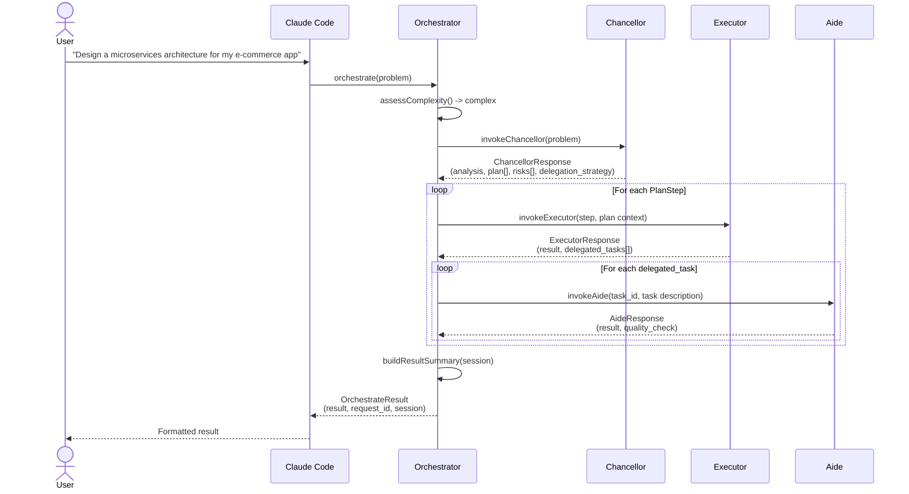
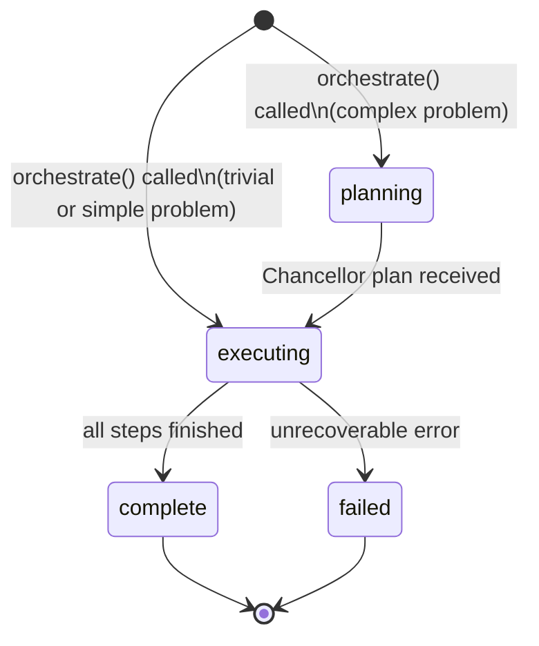

# The Council

[](https://www.npmjs.com/package/council-mcp)
[](https://github.com/iamvirul/the-council/actions/workflows/ci.yml)
[](https://opensource.org/licenses/MIT)

A three-tier AI agent orchestration system that runs inside Claude Code. No separate API key needed.

The Council is a TypeScript [Model Context Protocol (MCP)](https://modelcontextprotocol.io) server with three Claude agents: **Chancellor**, **Executor**, and **Aide**. When you give it a problem, it figures out the complexity and sends it to the right agent. A formatting task goes straight to the fast Aide (Haiku). A coding task goes to the Executor (Sonnet). A design or architecture problem first goes through the Chancellor (Opus) for a plan, then the Executor runs each step, delegating simple sub-tasks to the Aide.

All agents run as sub-agents of your existing Claude Code session, so no extra authentication is needed.

---

## How It Works


Complexity routing uses a fast keyword + word count check. No extra LLM call.

| Signal | Complexity | Agents invoked |
|---|---|---|
| Word count > 60, or keywords: `plan`, `design`, `architect`, `strategy`, `analyze`, `assess`, `risk` | Complex | Chancellor -> Executor -> Aide (as needed) |
| Word count 15-60, no strong signal | Simple | Executor -> Aide (as needed) |
| Word count < 15, keywords: `format`, `convert`, `transform`, `clean`, `list`, `count` | Trivial | Aide only |

---

## Agent Roles

| Agent | Model | Role | Tools | Max turns |
|---|---|---|---|---|
| **Chancellor** | `claude-opus-4-6` | Deep analysis, planning, risk assessment | None (pure reasoning) | 3 |
| **Executor** | `claude-sonnet-4-6` | Implementation, code, delegation | `Read`, `Write`, `Edit`, `Bash`, `Glob`, `Grep` | 10 |
| **Aide** | `claude-haiku-4-5` | Formatting, data transformation, utilities | None (pure reasoning) | 3 |

---

## Orchestration Flow



---

## MCP Tools

| Tool | Description | Key inputs |
|---|---|---|
| `orchestrate` | Route a problem through The Council. Complexity is assessed automatically. | `problem` (string, max 10 000 chars) |
| `consult_chancellor` | Invoke the Chancellor directly for deep strategic analysis and a structured plan. | `problem`, `context?` |
| `execute_with_executor` | Invoke the Executor directly for implementation. Has file and shell tool access. | `task`, `plan_context?`, `session_id?` |
| `delegate_to_aide` | Invoke the Aide directly for simple, well-defined tasks. | `task` (max 2 000 chars), `task_id?`, `context?`, `session_id?` |
| `get_council_state` | Retrieve session state by ID, or list all active sessions. | `session_id?` |

---

## Installation

**Requirements:** Node.js 22+

### One-liner (macOS and Linux)

```bash
curl -fsSL https://raw.githubusercontent.com/iamvirul/the-council/main/install.sh | bash
```

This installs nothing globally. It adds the MCP server entry to your Claude config file (`~/Library/Application Support/Claude/claude_desktop_config.json` on macOS, `~/.config/Claude/claude_desktop_config.json` on Linux) and leaves everything else in the file untouched. Restart Claude Code after running it.

### Manual setup

Add this to your Claude Code MCP config:

```json
{
  "mcpServers": {
    "the-council": {
      "command": "npx",
      "args": ["-y", "council-mcp"]
    }
  }
}
```

Restart Claude Code and the tools will appear.

**No API key needed.** The Council runs inside your existing Claude Code session and inherits its authentication.

---

## Usage Examples

### Trivial - formatting

> "Use The Council to format this JSON into a clean, human-readable structure."

Routes to the **Aide** (Haiku 4.5). Fast and cheap.

### Complex - architecture design

> "Use The Council to design a microservices architecture for my e-commerce app."

Routes to the **Chancellor** (Opus 4.6) for analysis and planning. Each plan step runs through the **Executor** (Sonnet 4.6), which delegates simple sub-tasks to the **Aide**.

### Direct consultation - risk analysis

> "Consult the Chancellor about the risks in migrating our API from REST to GraphQL."

Calls `consult_chancellor` directly, skipping orchestration. Returns a structured `ChancellorResponse` with `analysis`, `risks[]`, `assumptions[]`, `success_metrics[]`, and `recommendations[]`.

---

## Session Lifecycle



Use `get_council_state` at any point to inspect a session. Each session tracks:
- Phase (`planning` / `executing` / `complete` / `failed`)
- Chancellor plan (if invoked)
- Executor step results
- Aide task results
- Metrics: total agent calls, agents invoked, duration

---

## Development

```bash
git clone https://github.com/iamvirul/the-council.git
cd the-council

npm install

npm run dev         # run with tsx, no compile step
npm run build       # compile TypeScript to dist/
npm run type-check  # TypeScript check only
npm test            # run tests with vitest
npm run test:watch  # vitest watch mode
```

### Project structure

```
src/
  domain/           # Pure types, constants, error classes - no I/O
    models/         # types.ts, schemas.ts - response shapes and Zod validators
    constants/      # index.ts - model IDs, MAX_TURNS, system prompts
  application/      # Agent invocation and orchestration logic
    orchestrator/   # Complexity assessment + full orchestration flow
    chancellor/     # Chancellor agent wrapper
    executor/       # Executor agent wrapper
    aide/           # Aide agent wrapper
  infra/            # External dependencies
    agent-sdk/      # runner.ts - wraps Claude Agent SDK query()
    state/          # In-process session state store (LRU, 500 session cap)
    logging/        # pino structured logger (stderr only)
  mcp/
    server/         # MCP server setup, tool registration, lifecycle
    tools/          # Zod schemas for all tool inputs
```

---

## Release

1. Bump version in `package.json`.
2. Update `CHANGELOG.md` - move Unreleased entries under the new version heading.
3. Tag and push: `git tag vX.Y.Z && git push origin vX.Y.Z`
4. GitHub Actions builds, creates a GitHub Release, and publishes to npm.

To enable npm publishing, add your `NPM_TOKEN` as a repository secret under **Settings -> Secrets and variables -> Actions**.

---

## License

MIT - see [LICENSE](LICENSE).
